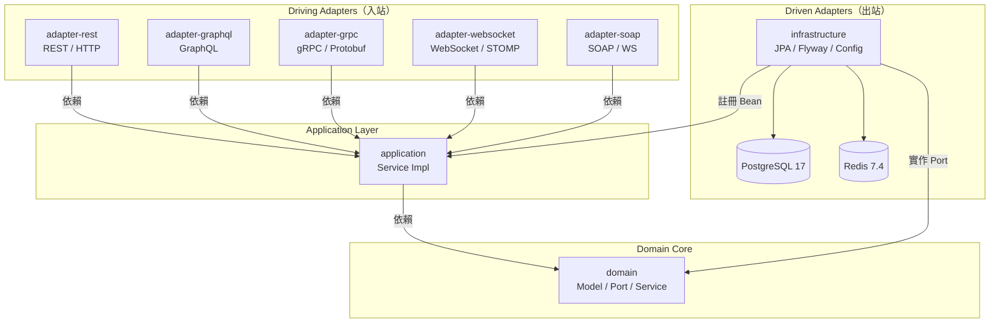
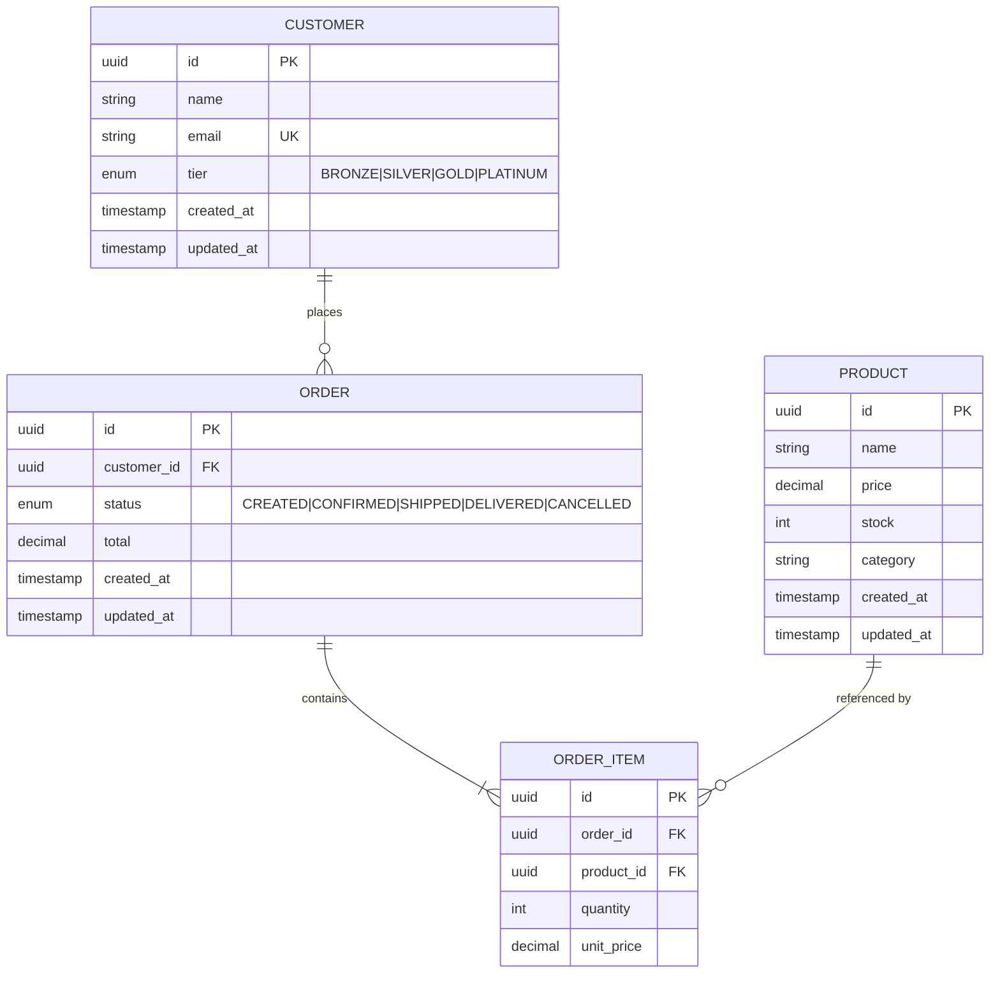
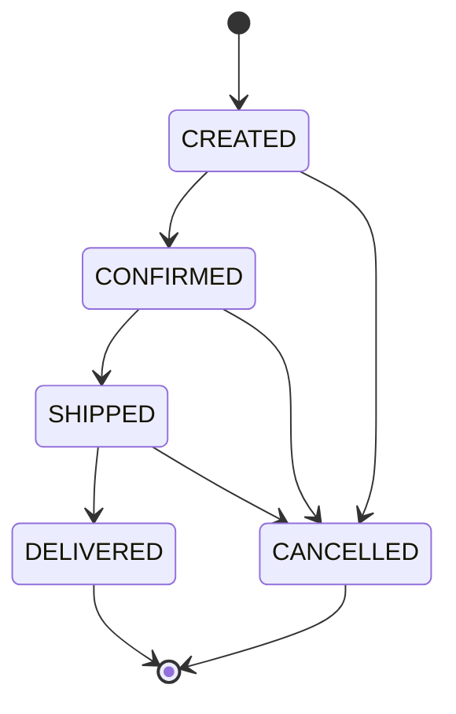
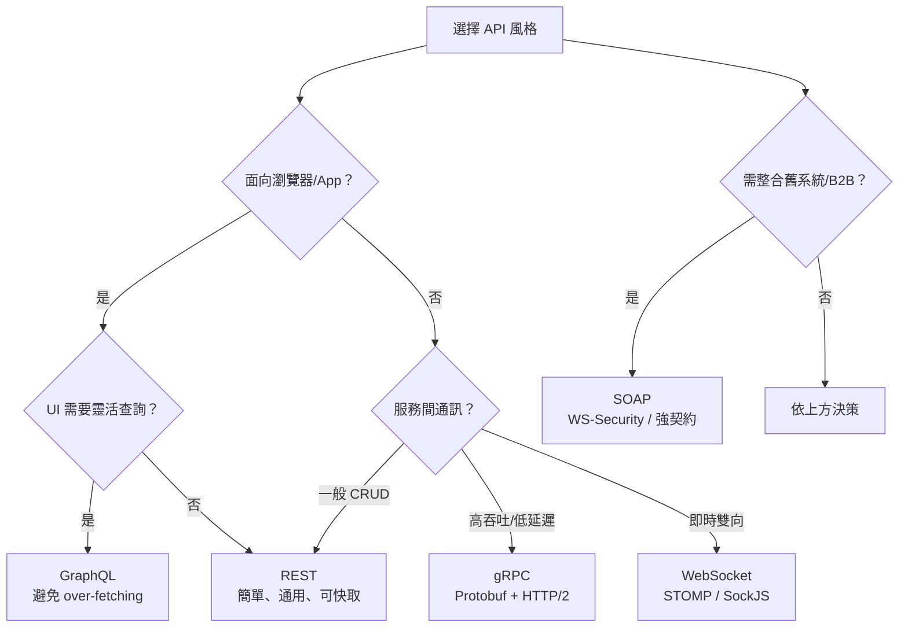
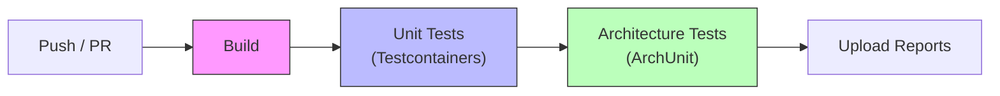

# API Architecture Styles PoC

> 同一業務場景下，比較五種 API 架構風格的實作差異 — 搭配 Hexagonal Architecture 與 DDD 實踐。
>
> 靈感來源: [API Architecture Styles Made Simple](https://blog.levelupcoding.com/p/api-architecture-styles)

## 概述

本專案以一個電商領域（Customer / Product / Order）為載體，同時實作五種 API 風格，讓開發者能在 **相同業務邏輯** 下直接比較各風格的優劣。架構採用 **Hexagonal Architecture（六角架構）**，核心領域與 API 適配器完全解耦。

## 支援的 API 風格

| 風格 | 協議 | 序列化 | 優勢 | 適用場景 |
|------|------|--------|------|----------|
| **REST** | HTTP/1.1 | JSON | 簡單、廣泛支援、Cacheable | 標準 CRUD、公開 API |
| **GraphQL** | HTTP/1.1 | JSON | 客戶端控制查詢、避免 over-fetching | 複雜 UI、儀表板 |
| **gRPC** | HTTP/2 | Protobuf | 高性能、低延遲、串流 | 服務間通訊、批次匯入 |
| **WebSocket** | WS/WSS | JSON | 雙向即時推播 | 即時通知、狀態更新 |
| **SOAP** | HTTP/1.1 | XML | 強型別、WS-Security | 企業 B2B、舊系統整合 |

> 這五種風格對應了 [API Architecture Styles Made Simple](https://blog.levelupcoding.com/p/api-architecture-styles) 一文所涵蓋的主要類型。該文建議根據問題本質而非習慣來選擇 API 風格 — 本專案讓你用同一套業務邏輯親手體驗差異。

## 技術堆疊

| 類別 | 技術 | 版本 |
|------|------|------|
| 語言 | Java | 21 |
| 框架 | Spring Boot | 3.4.1 |
| 建置 | Gradle (Kotlin DSL) | 8.5 |
| 資料庫 | PostgreSQL | 17 |
| 快取 | Redis | 7.4 |
| ORM | Hibernate / JPA | — |
| 遷移 | Flyway | 10.22.0 |
| gRPC | grpc-java + protobuf | 1.69.0 / 4.29.3 |
| API 文件 | SpringDoc OpenAPI (Swagger UI) | — |
| 測試 | JUnit 5 + AssertJ + Mockito | 5.11.4 |
| 容器測試 | Testcontainers | 1.20.4 |
| 架構測試 | ArchUnit | 1.3.0 |
| CI/CD | GitHub Actions | — |

## 架構總覽



> **依賴方向**：所有箭頭都指向內層（Domain）。Adapter 透過 Application 的 inbound port 呼叫業務邏輯；Infrastructure 實作 Domain 的 outbound port（Repository），並透過 `@Configuration` 註冊 Application 層的 Bean。Domain 不依賴任何外層。

## 領域模型



### 訂單狀態機



### 客戶等級折扣

| 等級 | 折扣率 | 說明 |
|------|--------|------|
| BRONZE | 0% | 新客戶預設等級 |
| SILVER | 5% | 一般會員 |
| GOLD | 10% | 進階會員 |
| PLATINUM | 15% | 最高等級 |

## 專案結構

```
graphql-tutorial/                  # Git repo（Gradle rootProject.name = "api-styles-poc"）
├── domain/                        # 領域層 — 核心業務邏輯（零框架依賴）
│   └── src/main/java/.../domain/
│       ├── model/                 # 領域模型 (Customer, Order, Product, OrderItem)
│       │                          #   列舉: CustomerTier, OrderStatus
│       ├── exception/             # Sealed 例外階層 (DomainException)
│       │                          #   EntityNotFoundException
│       │                          #   InvalidEntityException
│       │                          #   InvalidStateTransitionException
│       │                          #   InsufficientStockException
│       ├── port/
│       │   ├── inbound/           # 入站端口 (CustomerService, OrderService, ...)
│       │   └── outbound/          # 出站端口 (CustomerRepository, OrderRepository, ...)
│       └── service/               # 領域服務 (OrderDomainService — 跨聚合規則)
│
├── application/                   # 應用層 — 用例協調
│   └── src/main/java/.../application/
│       └── *ServiceImpl.java      # 入站端口實作
│
├── infrastructure/                # 基礎設施層 — 持久化實作
│   └── src/main/java/.../infrastructure/
│       ├── persistence/
│       │   ├── entity/            # JPA 實體 (CustomerEntity, OrderEntity, ...)
│       │   ├── repository/        # Spring Data JPA Repository
│       │   └── mapper/            # Entity ↔ Domain 轉換
│       └── resources/
│           └── db/migration/      # Flyway 遷移腳本
│
├── adapter-rest/                  # REST 適配器 (Port 8080)
│   ├── controller/                #   RFC 9457 Problem Details 錯誤處理
│   └── dto/                       #   Request/Response DTO
│
├── adapter-graphql/               # GraphQL 適配器
│   ├── resolver/                  #   Query/Mutation Resolver
│   ├── config/                    #   MaxQueryDepth(5) + MaxQueryComplexity(100)
│   └── resources/schema.graphqls  #   GraphQL Schema
│
├── adapter-grpc/                  # gRPC 適配器
│   ├── service/                   #   gRPC Service 實作
│   └── proto/                     #   .proto 定義 (customer, order, product)
│
├── adapter-websocket/             # WebSocket/STOMP 適配器
│   ├── handler/                   #   訂單狀態即時推播
│   └── config/                    #   STOMP + SockJS + Redis Pub/Sub
│
├── adapter-soap/                  # SOAP 適配器
│   ├── endpoint/                  #   SOAP Endpoint
│   └── resources/*.xsd            #   XML Schema 定義
│
├── test-support/                  # 共用測試工具
│   ├── annotations/               #   @IntegrationTest, @DatabaseTest, @CacheTest
│   ├── containers/                #   Testcontainers (PostgreSQL, Redis)
│   └── fixture/                   #   測試資料建構器
│
├── architecture-tests/            # ArchUnit 架構守護測試
│
├── .github/workflows/ci.yml      # GitHub Actions CI/CD
├── docker-compose.yml             # 本地開發環境 (PostgreSQL + Redis)
├── gradle/libs.versions.toml      # Gradle Version Catalog（集中管理版本）
└── build.gradle.kts               # 根建置腳本
```

## 快速開始

### 前置需求

- Java 21+
- Docker & Docker Compose
- Gradle 8.5+（或使用專案內建 `gradlew`）

### 1. Clone 並啟動本地基礎設施

```bash
git clone https://github.com/ChunPingWang/graphql-tutorial.git
cd graphql-tutorial
docker-compose up -d
```

這會啟動：
- **PostgreSQL 17** — `localhost:5432`（帳號 `apistyles / apistyles`）
- **Redis 7.4** — `localhost:6379`

### 2. 編譯專案

```bash
./gradlew build -x test
```

### 3. 啟動應用程式

```bash
./gradlew :adapter-rest:bootRun
```

應用程式啟動於 `http://localhost:8080`，Flyway 會自動建立資料庫 Schema。

### 4. 執行測試

```bash
# 領域層單元測試
./gradlew :domain:test

# 應用層單元測試
./gradlew :application:test

# 架構守護測試
./gradlew :architecture-tests:test

# 全部測試
./gradlew test
```

## API 端點參考

### REST API (`/api/v1`)

**Customers**

| 方法 | 路徑 | 描述 |
|------|------|------|
| GET | `/api/v1/customers` | 取得所有客戶 |
| GET | `/api/v1/customers/{id}` | 取得單一客戶 |
| POST | `/api/v1/customers` | 建立客戶 |
| PUT | `/api/v1/customers/{id}` | 更新客戶 |
| DELETE | `/api/v1/customers/{id}` | 刪除客戶 |

**Orders**

| 方法 | 路徑 | 描述 |
|------|------|------|
| GET | `/api/v1/orders` | 取得所有訂單 |
| GET | `/api/v1/orders/{id}` | 取得單一訂單 |
| POST | `/api/v1/orders` | 建立訂單 |
| PUT | `/api/v1/orders/{id}/confirm` | 確認訂單 |
| PUT | `/api/v1/orders/{id}/ship` | 出貨 |
| PUT | `/api/v1/orders/{id}/deliver` | 送達 |
| PUT | `/api/v1/orders/{id}/cancel` | 取消訂單 |

**Products**

| 方法 | 路徑 | 描述 |
|------|------|------|
| GET | `/api/v1/products` | 取得所有產品 |
| GET | `/api/v1/products/{id}` | 取得單一產品 |
| POST | `/api/v1/products` | 建立產品 |
| PUT | `/api/v1/products/{id}/stock` | 更新庫存 |

**Dashboard**

| 方法 | 路徑 | 描述 |
|------|------|------|
| GET | `/api/v1/dashboard/{customerId}` | 客戶儀表板（近期訂單 + 熱門商品） |

> REST 端點使用 RFC 9457 Problem Details 標準回傳錯誤，例如 `EntityNotFoundException` 回傳 HTTP 404 + `application/problem+json`。

### GraphQL (`/graphql`)

```graphql
# 查詢客戶儀表板 — 一次取得所有需要的資料
query Dashboard($customerId: ID!) {
  dashboard(customerId: $customerId) {
    customer { name email tier }
    recentOrders { id status total items { quantity unitPrice } }
    topProducts { name price stock }
  }
}

# 建立訂單
mutation CreateOrder {
  createOrder(input: {
    customerId: "uuid"
    items: [{ productId: "uuid", quantity: 2, unitPrice: 29.99 }]
  }) {
    id status total
  }
}
```

> GraphQL 端點已配置查詢深度限制 (MaxDepth=5) 和複雜度限制 (MaxComplexity=100) 防止濫用。

### gRPC (Port 由 grpc-spring-boot-starter 管理)

```protobuf
// customer.proto — CRUD 操作
service CustomerService {
    rpc GetCustomer(GetCustomerRequest) returns (CustomerResponse);
    rpc CreateCustomer(CreateCustomerRequest) returns (CustomerResponse);
    rpc ListCustomers(ListCustomersRequest) returns (ListCustomersResponse);
    rpc UpdateCustomer(UpdateCustomerRequest) returns (CustomerResponse);
    rpc DeleteCustomer(DeleteCustomerRequest) returns (DeleteCustomerResponse);
}

// product.proto — CRUD + Client Streaming 批次匯入
service ProductService {
    rpc GetProduct(GetProductRequest) returns (ProductResponse);
    rpc CreateProduct(CreateProductRequest) returns (ProductResponse);
    rpc ListProducts(ListProductsRequest) returns (ListProductsResponse);
    rpc UpdateStock(UpdateStockRequest) returns (ProductResponse);
    rpc ImportProducts(stream ImportProductsRequest) returns (ImportProductsResponse);
}

// order.proto — 建立 + 狀態轉換
service OrderService {
    rpc GetOrder(GetOrderRequest) returns (OrderResponse);
    rpc CreateOrder(CreateOrderRequest) returns (OrderResponse);
    rpc ConfirmOrder(ConfirmOrderRequest) returns (OrderResponse);
    rpc ShipOrder(ShipOrderRequest) returns (OrderResponse);
    rpc DeliverOrder(DeliverOrderRequest) returns (OrderResponse);
    rpc CancelOrder(CancelOrderRequest) returns (OrderResponse);
}
```

### WebSocket (STOMP over SockJS)

```javascript
const socket = new SockJS('/ws');
const stompClient = Stomp.over(socket);

stompClient.connect({}, () => {
    // 訂閱特定訂單的狀態更新
    stompClient.subscribe('/topic/orders/{orderId}/status', (message) => {
        const statusUpdate = JSON.parse(message.body);
        console.log('Order status changed:', statusUpdate);
    });
});
```

### SOAP (`/ws`)

```xml
<soapenv:Envelope xmlns:soapenv="http://schemas.xmlsoap.org/soap/envelope/"
                  xmlns:soap="http://poc.apistyles.com/soap">
   <soapenv:Body>
      <soap:GetCustomerRequest>
         <soap:id>uuid-here</soap:id>
      </soap:GetCustomerRequest>
   </soapenv:Body>
</soapenv:Envelope>
```

## 五種 API 風格比較

本專案以同一業務場景實作五種 API 風格，以下是實際開發經驗的比較：

### 同場景實作差異

| 面向 | REST | GraphQL | gRPC | WebSocket | SOAP |
|------|------|---------|------|-----------|------|
| **儀表板查詢** | 需呼叫 3 個端點 | 1 次查詢取得全部 | 需自行組合 3 次 RPC | 不適用 | 需多次請求 |
| **訂單狀態更新** | PUT 各狀態端點 | Mutation | 各狀態獨立 RPC | 即時推播 | XML 封裝 |
| **批次匯入產品** | 需逐筆或自訂端點 | 需自訂 Mutation | Client Streaming 原生支援 | 不適用 | 冗長 XML |
| **Schema 定義** | OpenAPI (Swagger) | `.graphqls` SDL | `.proto` IDL | 無正式 Schema | `.xsd` XML Schema |
| **錯誤處理** | RFC 9457 Problem Details | GraphQL errors 陣列 | gRPC Status Code | 自訂訊息格式 | SOAP Fault |
| **型別安全** | 中（靠 DTO 驗證） | 中（Schema 驗證） | 高（Protobuf 編譯期） | 低 | 高（XSD 驗證） |

### 何時選擇哪種風格？



> 上述決策框架與 [API Architecture Styles Made Simple](https://blog.levelupcoding.com/p/api-architecture-styles) 所建議的一致：根據問題本質選擇 API 風格，而非預設使用熟悉的技術。

## 架構守護 (ArchUnit) — 教學與實踐

> ArchUnit 讓架構規範從「口頭約定」變成「自動化測試」。每次 CI 都會驗證依賴方向，防止架構腐化。

### 為什麼需要 ArchUnit？

六角架構最重要的規則是 **依賴方向：外圈 → 內圈**，Domain 層絕不能反向依賴 Adapter 或 Infrastructure。然而在多人協作的專案中，只靠 Code Review 很容易遺漏違規。ArchUnit 將這些規則寫成可執行的測試，違反時直接 CI 失敗。

### 測試總覽（20 條規則）

本專案的 `architecture-tests` 模組包含 4 個測試類別、共 20 條架構規則：

| 測試類別 | 規則數 | 驗證範疇 |
|----------|--------|----------|
| `HexagonalArchitectureTest` | 6 | 六角架構核心：Domain 不依賴外層、Port 必須是 Interface |
| `LayerDependencyTest` | 6 | 層間依賴白名單、禁止循環依賴 |
| `NamingConventionTest` | 6 | 類別命名規範（Service / Repository / Controller 等） |
| `CodingRulesTest` | 3 | 編碼規範（禁止 Field Injection、禁止 public 欄位） |

```bash
# 執行全部架構測試
./gradlew :architecture-tests:test
```

### 教學 1：六角架構依賴守護 (`HexagonalArchitectureTest`)

六角架構的核心不變量是 **Domain 不依賴任何外層**。以下三條規則分別防止 Domain 反向依賴 Adapter、Infrastructure、Application：

```java
// Domain 不得依賴 Adapter
ArchRuleDefinition.noClasses()
    .that().resideInAPackage("com.poc.apistyles.domain..")
    .should().dependOnClassesThat()
    .resideInAPackage("com.poc.apistyles.adapter..");

// Domain 不得依賴 Infrastructure
ArchRuleDefinition.noClasses()
    .that().resideInAPackage("com.poc.apistyles.domain..")
    .should().dependOnClassesThat()
    .resideInAPackage("com.poc.apistyles.infrastructure..");

// Domain 不得依賴 Application
ArchRuleDefinition.noClasses()
    .that().resideInAPackage("com.poc.apistyles.domain..")
    .should().dependOnClassesThat()
    .resideInAPackage("com.poc.apistyles.application..");
```

另外三條規則確保 Port 必須是 Interface（DIP 原則），讓外層透過介面與內層溝通：

```java
// Port 套件內的頂層類別必須是 Interface
ArchRuleDefinition.classes()
    .that().resideInAPackage("com.poc.apistyles.domain.port..")
    .and().areTopLevelClasses()  // 排除 inner record（如 DashboardService.Dashboard）
    .should().beInterfaces();
```

> **設計決策**：使用 `.areTopLevelClasses()` 排除 Port 介面內定義的 DTO record（如 `DashboardService.Dashboard`），這些 record 是 Value Object，合理地共存於 Port 介面內。

### 教學 2：層間依賴白名單 (`LayerDependencyTest`)

除了「不能依賴誰」，ArchUnit 也能規定「只能依賴誰」（白名單模式），更加嚴格：

```java
// Adapter 層只能依賴 Domain / Application + 框架 + 自身
ArchRuleDefinition.classes()
    .that().resideInAPackage("com.poc.apistyles.adapter..")
    .and().resideOutsideOfPackage("com.poc.apistyles.adapter.grpc.protobuf..")
    .should().onlyDependOnClassesThat()
    .resideInAnyPackage(
        "com.poc.apistyles.domain..",      // 內層
        "com.poc.apistyles.application..", // 內層
        "com.poc.apistyles.adapter..",     // 自身
        "java..",                           // JDK
        "org.springframework..",            // 框架
        "jakarta..",                        // Jakarta EE
        "io.grpc..",                        // gRPC
        "net.devh..",                       // gRPC Spring Boot Starter
        "graphql..",                        // GraphQL
        "io.swagger..",                     // OpenAPI
        "com.google.protobuf..",            // Protobuf
        "javax.annotation.."               // JSR-250
    );
```

> **處理生成程式碼**：gRPC protobuf 生成的類別（`adapter.grpc.protobuf..`）會依賴 protobuf 內部 API，所以用 `.resideOutsideOfPackage()` 排除。

**循環依賴偵測** — 使用 `SlicesRuleDefinition` 確保同一層內的子套件之間沒有循環依賴：

```java
import static com.tngtech.archunit.library.dependencies.SlicesRuleDefinition.slices;

slices().matching("com.poc.apistyles.domain.(*)..")
    .should().beFreeOfCycles();
```

**Domain Model 純淨性** — 進一步限制 Domain Model 只能依賴自身和 Domain Exception：

```java
ArchRuleDefinition.classes()
    .that().resideInAPackage("com.poc.apistyles.domain.model..")
    .should().onlyDependOnClassesThat()
    .resideInAnyPackage(
        "com.poc.apistyles.domain.model..",
        "com.poc.apistyles.domain.exception..",
        "java.."
    );
```

### 教學 3：命名規範 (`NamingConventionTest`)

統一命名能降低認知負擔，ArchUnit 可以自動驗證：

```java
// Application 層的頂層類別必須包含 "Service"
ArchRuleDefinition.classes()
    .that().resideInAPackage("com.poc.apistyles.application..")
    .and().areTopLevelClasses()
    .should().haveSimpleNameContaining("Service");

// Adapter 層的頂層類別必須以約定後綴結尾
ArchRuleDefinition.classes()
    .that().resideInAPackage("com.poc.apistyles.adapter..")
    .and().resideOutsideOfPackage("com.poc.apistyles.adapter.grpc.protobuf..")
    .and().areTopLevelClasses()
    .and().areNotInterfaces()
    .should().haveSimpleNameEndingWith("Controller")
    .orShould().haveSimpleNameEndingWith("Resolver")
    .orShould().haveSimpleNameEndingWith("Service")
    .orShould().haveSimpleNameEndingWith("Endpoint")
    .orShould().haveSimpleNameEndingWith("Config")
    .orShould().haveSimpleNameEndingWith("Handler")
    .orShould().haveSimpleNameEndingWith("Application")
    .orShould().haveSimpleNameEndingWith("Request")
    .orShould().haveSimpleNameEndingWith("Response")
    .orShould().haveSimpleNameEndingWith("Input")
    .orShould().haveSimpleNameEndingWith("Data");

// 出站端口必須以 Repository 結尾
ArchRuleDefinition.classes()
    .that().resideInAPackage("com.poc.apistyles.domain.port.outbound..")
    .and().areInterfaces()
    .should().haveSimpleNameEndingWith("Repository");
```

### 教學 4：編碼規範 (`CodingRulesTest`)

強制實施團隊編碼標準，例如禁止 Field Injection：

```java
// 禁止 @Autowired field injection — 應使用 Constructor Injection
noFields().should()
    .beAnnotatedWith(Autowired.class)
    .because("Field injection is not recommended. Use constructor injection instead.");

// 禁止 public 欄位（排除 enum 常數與 protobuf 生成碼）
fields()
    .that().areDeclaredInClassesThat()
    .resideOutsideOfPackage("com.poc.apistyles.adapter.grpc.protobuf..")
    .and().areDeclaredInClassesThat().areNotEnums()
    .should().notBePublic()
    .because("Classes should encapsulate their fields.");
```

> **常見陷阱**：Java `enum` 的常數（如 `OrderStatus.CREATED`）在位元碼層面是 `public static final` 欄位，必須用 `.areNotEnums()` 排除。gRPC protobuf 生成碼同理，有大量 `public static final int` 欄位常數。

### 教學 5：在你的專案中引入 ArchUnit

**Step 1** — 新增獨立的 Gradle 模組 `architecture-tests`，將測試與業務邏輯分離：

```kotlin
// architecture-tests/build.gradle.kts
dependencies {
    testImplementation(libs.archunit.junit5)
    testImplementation(libs.junit.jupiter)
    // 加入所有需要掃描的模組
    testImplementation(project(":domain"))
    testImplementation(project(":application"))
    testImplementation(project(":infrastructure"))
    testImplementation(project(":adapter-rest"))
    testImplementation(project(":adapter-graphql"))
    // ...
}
```

**Step 2** — 建立 `@BeforeAll` 匯入所有類別（只載入一次，供所有測試共用）：

```java
@BeforeAll
static void setup() {
    importedClasses = new ClassFileImporter()
        .importPackages(
            "com.poc.apistyles.domain..",
            "com.poc.apistyles.application..",
            "com.poc.apistyles.adapter..",
            "com.poc.apistyles.infrastructure.."
        );
}
```

**Step 3** — 從最重要的規則開始，逐步新增：

1. 先寫 **依賴方向** 規則（六角架構核心）
2. 再加 **編碼規範** 規則（Field Injection、public 欄位）
3. 最後加 **命名規範** 規則（可選但建議）

**Step 4** — 整合到 CI/CD Pipeline，確保每次提交都驗證：

```yaml
# .github/workflows/ci.yml
- name: Architecture Tests
  run: ./gradlew :architecture-tests:test
```

### 常見問題與解法

| 問題 | 解法 |
|------|------|
| 生成程式碼違規（Protobuf/gRPC） | `.resideOutsideOfPackage("..protobuf..")` 排除 |
| Enum 常數被判定為 public 欄位 | `.areDeclaredInClassesThat().areNotEnums()` |
| Inner class / record 違反命名規則 | `.areTopLevelClasses()` 只檢查頂層類別 |
| Application 層無子套件導致 Slice 為空 | `.allowEmptyShould(true)` |
| 框架依賴未列入白名單 | 在 `resideInAnyPackage()` 中新增該框架的 package |

## Domain 例外處理

採用 Java 17+ Sealed Class 階層，確保所有領域例外都有明確型別：

```
DomainException (sealed)
├── EntityNotFoundException         → REST 404
├── InvalidEntityException          → REST 400
├── InvalidStateTransitionException → REST 409
└── InsufficientStockException      → REST 409
```

REST 端點透過 `GlobalExceptionHandler` 自動將例外轉為 RFC 9457 `ProblemDetail` 回應。

## CI/CD Pipeline



Pipeline 自動啟動 PostgreSQL 17 + Redis 7.4 作為 Service Container，使用 Testcontainers 的 `@ServiceConnection` 自動連線。

## 學習路線

### 第一階段：理解六角架構

1. **閱讀 Domain 層** — 從 `domain/` 模組開始，理解純 Java 領域模型如何不依賴任何框架
2. **觀察 Port 接口** — `port/inbound/` 定義業務能力，`port/outbound/` 定義對外需求
3. **追蹤 Application 層** — `*ServiceImpl` 如何協調 Port 完成用例
4. **查看 Infrastructure** — JPA Entity 如何透過 Mapper 與 Domain Model 轉換

### 第二階段：比較 API 風格

5. **REST vs GraphQL** — 比較 Dashboard 查詢：REST 需多次呼叫 vs GraphQL 一次取得
6. **REST vs gRPC** — 比較產品 CRUD：JSON + HTTP/1.1 vs Protobuf + HTTP/2
7. **gRPC Streaming** — 觀察 `ProductService.ImportProducts` 如何用 Client Streaming 批次匯入
8. **WebSocket 即時** — 觀察訂單狀態變更如何透過 STOMP 即時推播
9. **SOAP 對比** — 感受 XML Schema + SOAP Envelope 的冗長與嚴謹

### 第三階段：品質保證

10. **單元測試** — 觀察 Domain 測試如何驗證狀態機轉換、不可變性、驗證規則
11. **架構測試** — 理解 ArchUnit 如何自動防止架構腐化
12. **Testcontainers** — 觀察 `@ServiceConnection` 如何自動連接測試容器

## 學習資源

### Hexagonal Architecture / DDD

- [Hexagonal Architecture (Alistair Cockburn)](https://alistair.cockburn.us/hexagonal-architecture/) — 六角架構原創文章
- [DDD, Hexagonal, Onion, Clean, CQRS... How I put it all together](https://herbertograca.com/2017/11/16/explicit-architecture-01-ddd-hexagonal-onion-clean-cqrs-how-i-put-it-all-together/) — 整合各種架構風格的經典文章
- [Get Your Hands Dirty on Clean Architecture (Tom Hombergs)](https://reflectoring.io/book/) — Spring Boot + 六角架構實戰書籍

### API 風格比較

- [API Architecture Styles Made Simple](https://blog.levelupcoding.com/p/api-architecture-styles) — 本專案靈感來源，比較五種 API 風格的選擇框架
- [REST vs GraphQL vs gRPC (ByteByteGo)](https://blog.bytebytego.com/p/rest-vs-graphql-vs-grpc) — 圖解三種主流風格
- [Choosing Between REST, GraphQL, and gRPC (Google Cloud)](https://cloud.google.com/blog/products/api-management/choosing-between-rest-graphql-and-grpc) — Google Cloud 的選擇指南

### REST

- [Spring Boot REST API Best Practices](https://www.baeldung.com/rest-with-spring-series) — Baeldung REST 系列
- [RFC 9457: Problem Details for HTTP APIs](https://www.rfc-editor.org/rfc/rfc9457) — 本專案採用的錯誤回應標準
- [SpringDoc OpenAPI](https://springdoc.org/) — Swagger UI 自動生成

### GraphQL

- [GraphQL 官方教學](https://graphql.org/learn/) — 入門必讀
- [Spring for GraphQL Reference](https://docs.spring.io/spring-graphql/reference/) — Spring 官方 GraphQL 整合文件
- [Production Ready GraphQL (Marc-Andre Giroux)](https://book.productionreadygraphql.com/) — GraphQL 安全與效能最佳實踐

### gRPC

- [gRPC 官方文件](https://grpc.io/docs/) — 入門指南與概念
- [gRPC-Java Tutorial](https://grpc.io/docs/languages/java/basics/) — Java gRPC 基礎
- [Language Guide (proto3)](https://protobuf.dev/programming-guides/proto3/) — Protocol Buffers 語法參考

### WebSocket

- [Spring WebSocket Reference](https://docs.spring.io/spring-framework/reference/web/websocket.html) — Spring 官方 WebSocket 文件
- [Using STOMP over WebSocket](https://docs.spring.io/spring-framework/reference/web/websocket/stomp.html) — STOMP 協定整合

### SOAP

- [Spring Web Services Reference](https://docs.spring.io/spring-ws/docs/current/reference/html/) — Spring WS 官方文件

### 測試

- [Testcontainers for Java](https://java.testcontainers.org/) — 容器化整合測試
- [ArchUnit User Guide](https://www.archunit.org/userguide/html/000_Index.html) — 架構測試完整指南
- [AssertJ Documentation](https://assertj.github.io/doc/) — 流暢斷言 API

### Spring Boot 生態

- [Spring Boot Reference (3.4.x)](https://docs.spring.io/spring-boot/docs/3.4.1/reference/html/) — 官方文件
- [Spring Data JPA Reference](https://docs.spring.io/spring-data/jpa/reference/) — JPA 資料存取
- [Flyway Documentation](https://documentation.red-gate.com/fd/) — 資料庫版本控制

### Gradle

- [Gradle Version Catalogs](https://docs.gradle.org/current/userguide/platforms.html) — 本專案使用的集中版本管理機制

## 授權

MIT License
