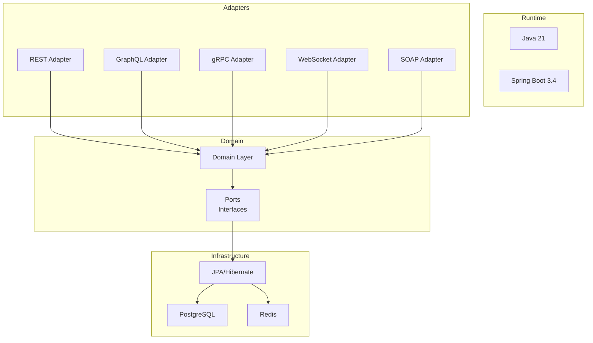
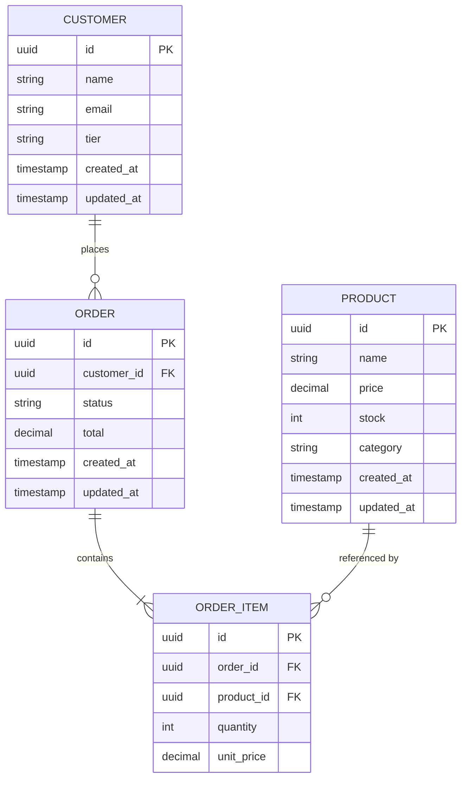
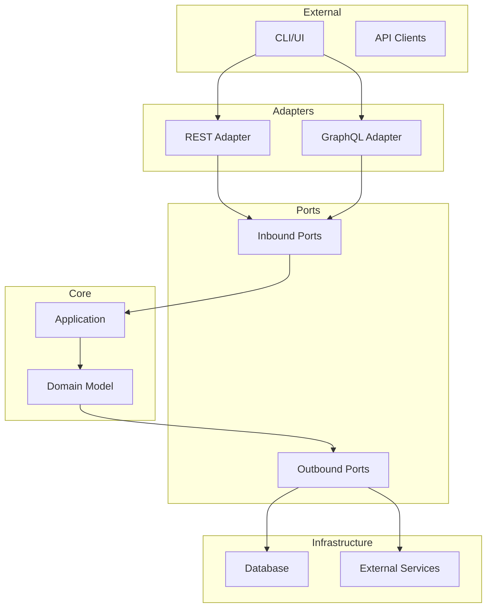
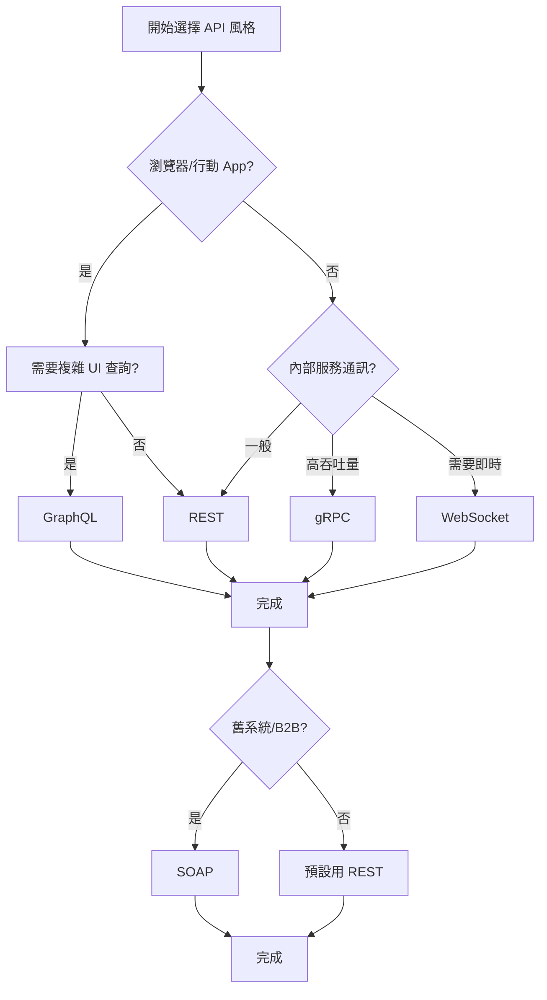
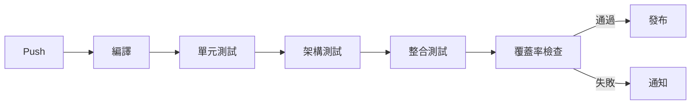

# API Architecture Styles PoC

## 概述

本專案是一個 **API 架構風格 PoC (Proof of Concept)**，旨在比較五種主要的 API 設計風格在同一業務場景下的表現差異。

## 支援的 API 風格

| 風格 | 協議 | 優勢 | 適用場景 |
|------|------|------|----------|
| **REST** | HTTP/1.1 | 簡單、廣泛支援、Cacheable | 標準 CRUD 操作 |
| **GraphQL** | HTTP/1.1 | 客戶端控制查詢、避免 over-fetching | 複雜查詢儀表板 |
| **gRPC** | HTTP/2 | 高性能、低延遲、雙向流 | 服務間通訊 |
| **WebSocket** | WS/WSS | 雙向即時通訊 | 實時通知 |
| **SOAP** | HTTP/1.1 | 強類型、WS-Security | 企業級 B2B |

## 技術堆疊



## 領域模型



## 專案結構

```
api-styles-poc/
├── domain/                    # 領域驅動設計 - 核心業務邏輯
│   └── src/main/java/.../domain/
│       ├── model/             # 領域模型 (Customer, Order, Product)
│       └── port/              # 端口接口
│           ├── inbound/       # 應用服務接口
│           └── outbound/      # 倉儲接口
│
├── application/               # 應用層 - 用例協調
│   └── src/main/java/.../application/
│       └── *ServiceImpl.java # 服務實現
│
├── infrastructure/            # 基礎設施層 - 外部適配器
│   └── src/main/java/.../infrastructure/
│       └── persistence/       # JPA 實現
│
├── adapter-rest/              # REST API 適配器
├── adapter-graphql/           # GraphQL API 適配器
├── adapter-grpc/              # gRPC API 適配器
├── adapter-websocket/         # WebSocket 適配器
├── adapter-soap/              # SOAP API 適配器
│
├── test-support/              # 測試支援模組
├── architecture-tests/        # 架構測試 (ArchUnit)
│
└── docker-compose.yml         # 本地開發環境
```

## 快速開始

### 1. 啟動本地資料庫

```bash
cd api-styles-poc
docker-compose up -d
```

### 2. 編譯專案

```bash
./gradlew build
```

### 3. 執行測試

```bash
# 單元測試
./gradlew test

# 架構測試
./gradlew architectureTests:test
```

## API 端點

### REST API

| 方法 | 路徑 | 描述 |
|------|------|------|
| GET | `/api/v1/customers` | 取得所有客戶 |
| GET | `/api/v1/customers/{id}` | 取得單一客戶 |
| POST | `/api/v1/customers` | 建立客戶 |
| PUT | `/api/v1/customers/{id}` | 更新客戶 |
| DELETE | `/api/v1/customers/{id}` | 刪除客戶 |
| GET | `/api/v1/dashboard/{customerId}` | 儀表板數據 |

### GraphQL

```graphql
# 查詢範例
query {
  customer(id: "uuid") {
    name
    email
    tier
  }
}

#  mutation 範例
mutation {
  createCustomer(input: {
    name: "John Doe"
    email: "john@example.com"
    tier: GOLD
  }) {
    id
    name
  }
}
```

### WebSocket

```javascript
// 訂閱訂單狀態更新
const socket = new SockJS('/ws');
const stompClient = Stomp.over(socket);

stompClient.connect({}, function(frame) {
    stompClient.subscribe('/topic/orders/{orderId}/status', function(message) {
        console.log(JSON.parse(message.body));
    });
});
```

### SOAP

```xml
<!-- SOAP 請求範例 -->
<soapenv:Envelope xmlns:soapenv="http://schemas.xmlsoap.org/soap/envelope/">
   <soapenv:Header/>
   <soapenv:Body>
      <GetCustomerRequest xmlns="http://poc.apistyles.com/soap">
         <id>uuid-here</id>
      </GetCustomerRequest>
   </soapenv:Body>
</soapenv:Envelope>
```

## 學習資源

### 什麼是 Hexagonal Architecture?



**核心原則**:
- **領域模型** (Domain Model) 是核心，不依賴任何框架
- **端口** (Ports) 定義業務與外部世界的接口
- **適配器** (Adapters) 實現端口，連接外部系統

### 為什麼要測試五種 API 風格?

| 假設 | REST | GraphQL | gRPC | WebSocket | SOAP |
|------|------|---------|------|-----------|------|
| 簡單操作最快 | ✓ | | | | |
| 複雜查詢最好 | | ✓ | | | |
| 高吞吐量 | | | ✓ | | |
| 即時雙向 | | | | ✓ | |
| 企業級安全 | | | | | ✓ |

## 架構決策框架



## 測試覆蓋率目標

| 模組 | 行覆蓋率 | 變異測試分數 |
|------|----------|--------------|
| domain | ≥ 95% | ≥ 75% |
| application | ≥ 90% | ≥ 70% |
| adapter-* | ≥ 80% | ≥ 55% |
| **總計** | **≥ 85%** | **≥ 65%** |

## GitHub Actions CI/CD



## 延伸閱讀

- [API Architecture Styles Made Simple](https://blog.levelupcoding.com/p/api-architecture-styles)
- [Testcontainers 文件](https://www.testcontainers.org/)
- [ArchUnit 文件](https://www.archunit.org/)
- [Spring Boot 文档](https://spring.io/projects/spring-boot)

## 授權

MIT License
